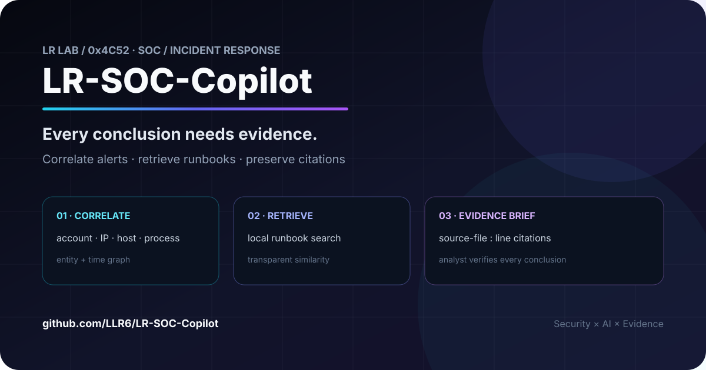
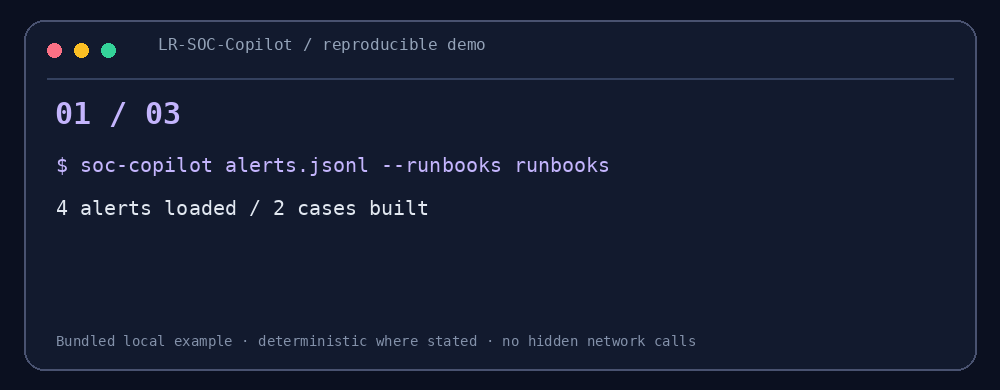

# LR-SOC-Copilot

<!-- LR-LAB-CHROME:START -->
<p align="center">
  <a href="https://github.com/LLR6"></a>
  
</p>
<p align="center"><strong>Every conclusion needs evidence.</strong><br><sub>Alert correlation and local runbook retrieval</sub></p>
<p align="center"><a href="https://github.com/LLR6/LR-SOC-Copilot/stargazers"></a>
   </p>
<p align="center"><a href="https://github.com/LLR6">Profile</a> · <a href="https://github.com/LLR6?tab=repositories">All projects</a> · <a href="https://github.com/LLR6/LR-SOC-Copilot/issues">Issues</a></p>
<!-- LR-LAB-CHROME:END -->

<!-- LR-SECOND-PASS:START -->
<p align="center"><a href="#5-分钟-demo">5-minute demo</a> · <a href="./runbooks">Runbooks</a> · <a href="./src">Source</a> · <a href="./tests">Tests</a></p>
<!-- LR-SECOND-PASS:END -->


<p align="center"></p>
<p align="center"></p>
<p align="center"><strong>Every conclusion needs evidence.</strong></p>
<p align="center">Alert correlation and local runbook retrieval for investigation.</p>
<p align="center">   </p>

## 30 秒看懂

把 JSONL 告警按时间窗口和共享实体组成案件图，再用本地词频向量检索 Runbook。每条结论保留 `文件:L行` 证据引用，调查员可以回到原始告警核对。

```text
Alerts → Entity/time graph → Cases → Runbook retrieval → Evidence brief
```

## 5 分钟 Demo

```bash
python -m pip install -e .
soc-copilot examples/alerts.jsonl --runbooks runbooks --output brief.md
soc-copilot examples/alerts.jsonl --runbooks runbooks --format json --output cases.json
```

样例把登录失败、随后成功登录和同主机异常子进程关联为一个案件；另一条 DNS 告警保持独立。案件分数是透明的分诊启发式。

## 三个核心设计

- **证据优先**：告警引用保留源文件行号，摘要不会脱离证据。
- **实体关联**：共享账号、IP、主机或进程且落在时间窗口内的告警进入同一连通分量。
- **本地知识检索**：Runbook 留在本机；当前版本使用可解释的词频余弦相似度。

## 边界

它不自动定性入侵，不替代分析员确认，也不会根据分数直接执行封禁。关联规则可能把同一共享实体上的无关活动连在一起，因此报告明确要求检查反证。

## 研究路线

加入 ATT&CK 映射、时间衰减、图特征、可选本地 LLM 摘要、引用完整性校验和调查反馈学习。

作者：LLR6 · MIT License

<!-- LR-LAB-FOOTER:START -->
---
<p align="center"><sub>Part of <a href="https://github.com/LLR6">LR Lab</a> · Security × AI × Android × Automation</sub><br><sub>Build things that are useful, inspectable, and reproducible.</sub></p>
<!-- LR-LAB-FOOTER:END -->

